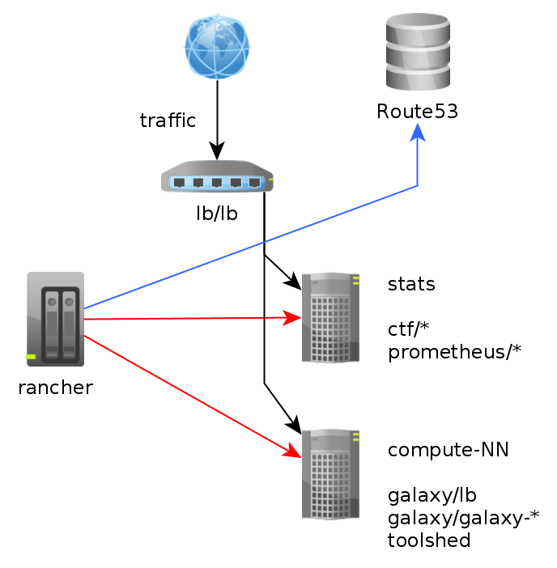
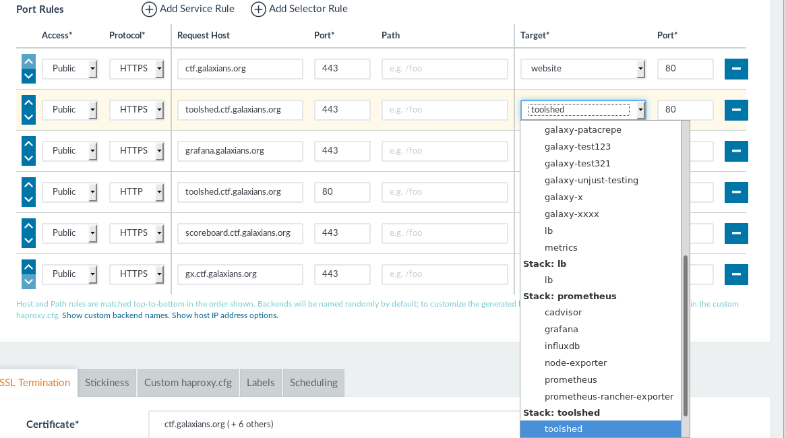

# Operations

Some people were curious about how the infrastructure was operated. Unfortunately (like every CTF that has ever been run), we started behind schedule and had some misconfiguration in monitoring resulting in no sexy graphs for this post. Next year!

Our original plan was to develop a GCCCTF image which could be deployed and would be mostly self contained (except for validation of scoring), and users could continue to play on their own afterward. We'll release this image shortly.

## Container

We've published the container [here](https://github.com/galaxy-ctf/ctf-image/tree/2017), but haven't solved building it yet. In a previous incarnation, we uploaded tools to the toolshed, and then the container included an install step that fetched and installed all tools from a given toolshed. The container is otherwise a pretty standard Galaxy image otherwise.

## Infrastructure Stack

Component   | Description
----------- | -----------
Rancher     | Container scheduling, routing, etc
LetsEncrypt | SSL
Route53     | DNS

Rancher manages scheduling of containers (red lines)

1. Rancher manages provisioning of the hosts
2. Once a host is attached it's free to have containers launched on it
3. The container gives back an (internal) IP address.
4. Rancher notices any exposed ports, if there are any, then an A record is added in route53 automatically, pointing `%{{service_name}}.%{{stack_name}}.galaxians.org` to the appropriate container host.

This is incredibly convenient but we didn't really take advantage of this, instead we launched a single `lb` (load balancer) container as entry/exit point for the traffic. All traffic went through this container. So, as a result our workflow looked like:

4. The admin adds a load balancer entry

  

5. We then add a `CNAME` DNS record for whatever domain name we want to our Route53 zone file, sync that, and wait for it to be available
6. Now, to add SSL we just have to upgrade the letsencrypt container with the new hostnames. The container takes care of auto-renewal, fetching and installing the certs, absolutely everything.

## Galaxy Containers

Automatic per-team Galaxy containers was pretty easy to do. Rancher has a really stellar (albeit complex) API, we could just inspect the network requests to discover what JSON to POST.

We then set up our CTF platform to just [check the team list](https://github.com/galaxy-ctf/milky-way/blob/master/milkyway/management/commands/rancher_sync.py#L401) on a [cron job](https://github.com/galaxy-ctf/milky-way/blob/master/crontab#L1), and to make the necessary infrasturcture changes (launch container + add load balancer rule)

## Monitoring

As some of you discovered, `gx.ctf.galaxians.org` hosted an iframe pointing at our grafana instance. We had hoped to show some nifty statistics here about the containers / CPU / mem / etc., but this did not work out as planned.
