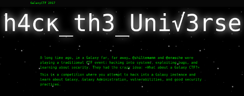

# Writeups

Below are solutions to the 2017 edition of Galaxy CTF. Go ahead and add your own too!



## Teams

**Team:** Galaxians  
**Members:** @erasche, @shiltemann

**Team:** Team2  
**Members:** member1, member2, member3

## Overview

```
Name                 Category      Points  Flag
-------------------- ------------- ------- ------------------------
Start Here           Warm-up       1       gccctf{th1s_i5_t0o_34sy!}

```


## Challenge Writeups


### Warm-up 1: Start Here

**Challenge**  
Welcome Galactic Hackers! In this capture the flag competition you're hunting for these strings called "flags". These flags always begin with "gccctf{" followed by a message and ending with "}" This first challenge is super easy, simply copy this flag and claim your first point! `gccctf{th1s_i5_t0o_34sy!}`

**Solution (Galaxians)**  
This was just an introductory challenge to familiarize users with the flag submission
system. Only thing you had to do was copy and paste.

**Flag**  
```
gccctf{th1s_i5_t0o_34sy!}
```


--------

### Template

Add new challenge entry like this:

### < category> < points>: < challenge name >

**Challenge**  
the description of the challenge (from scoreboard)

**Solution (team1)**  
your solution, thought process, feedback, complaints, screenshots, anything :)

**Solution (team2)**  

**Flag**  
```
gccctf{}
```
